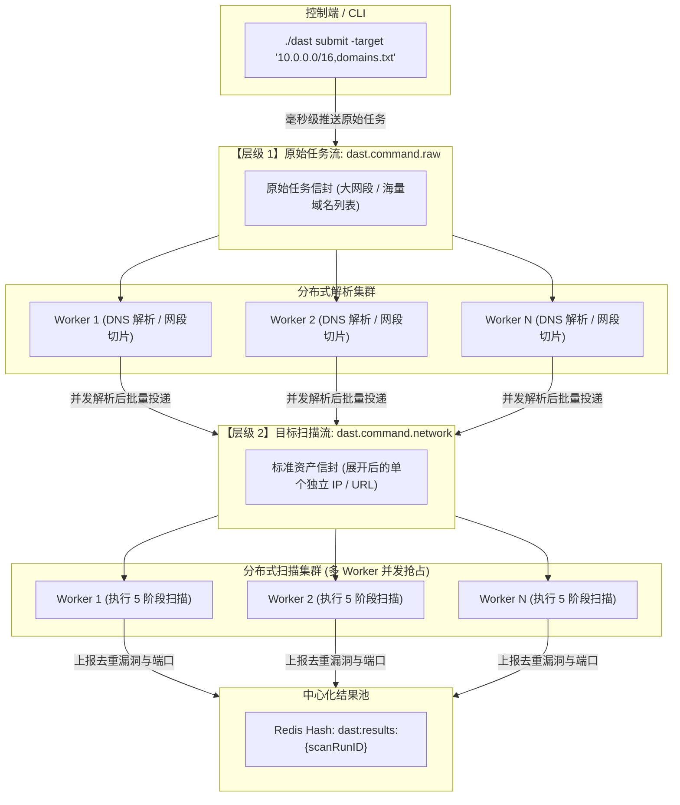

#  DAST 黑盒漏洞扫描器

> **5 阶段工业级流水线**：`目标展开/Scope评估` → `端口存活(原生Go/Nmap)` → `服务识别(Nmap -sV + Wappalyzer)` → `POC验证(Nuclei v3)` → `全局去重与报告输出`

---

## 0. 注意

注意代理软件 tun 模式 , fakeip 模式下对端口探活会有一定的影响

## 1. 环境准备与依赖安装

### ① 安装 Go 环境
- **版本要求**：`Go >= 1.24.0`

### ② 安装 Nmap 二进制文件
针对 bin 服务探测（`-sV`），扫描节点所在机器须安装 Nmap 并加入环境变量：

- **Ubuntu / Debian / WSL**：
  
  ```bash
  sudo apt update && sudo apt install -y nmap
  ```
- **macOS**：
  ```bash
  brew install nmap
  ```
- **Windows**：
  ```powershell
  scoop install nmap
  # 或从官方下载安装包: https://nmap.org/download.html
  ```

### ③ 获取 Nuclei POC 漏洞模板
Nuclei 引擎运行需要本地 YAML 格式的 POC 模板。可通过本扫描器内置命令一键拉取，或手动 Git 克隆：

- **方式 A（推荐）：使用内置命令一键同步**
  
  ```bash
  go run ./cmd/dast update --poc
  ```
- **方式 B：Git 手动克隆至 `./poc` 目录**
  ```bash
  git clone --depth 1 https://github.com/projectdiscovery/nuclei-templates.git ./poc
  ```

---

## 2. 项目目录结构

```text
DAST/
├── cmd/
│   └── dast/
│       └── main.go                 # 统一 CLI 命令行入口 (scan/submit/worker/api/normalize/update)
├── internal/
│   ├── engine/                     # 核心 5 阶段扫描流水线引擎
│   │   ├── 1_engine.go             # [阶段 1] 目标解析与展开
│   │   ├── 2_portscan.go           # [阶段 2] 端口存活与网络发现
│   │   ├── 3_service.go            # [阶段 3] 服务与技术栈识别规则
│   │   ├── 4_poc.go                # [阶段 4] Nuclei POC 
│   │   └── 5_dedup.go              # [阶段 5] 资产/漏洞确定性去重
│   ├── distributed/                # 分布式
│   │   ├── envelope.go             # 消息协议信封模式 (TraceID, 幂等键, 重试机制)
│   │   ├── streams.go              # Redis Streams 客户端底层封装
│   │   └── worker.go               # 双循环分布式工作节点
│   ├── api/                        # API 控制面服务 供第三方/前端集成
│   │   └── server.go               # /healthz 与 /api/v1/scans 路由定义
│   ├── model/                     
│   │   ├── target.go               
│   │   ├── scan.go                 # 扫描任务、Fact、资产
│   │   ├── finding.go              # 漏洞确证实体
│   │   └── policy.go               # 安全边界策略、限速与预算控制
│   ├── service/                    # 报告导出与外部poc资源同步服务
│   │   ├── report.go               # JSON 与 Markdown 多格式报告导出器
│   │   └── updater.go              # Nuclei POC 模板库与 SecLists 字典同步器
│   ├── storage/                    # 数据持久化
│   └── config/                     # 全局 YAML / 环境变量配置加载器
├── data/
│   └── fingerprints.json           # 指纹特征库
├── result/
│   └── scan_report.json            # 统一扫描定稿结果报告
├── go.mod / go.sum
└── README.md
```

---

## 3. 模式一：作为单个 CLI 独立运行扫描

### ① 编译生成独立可执行文件
```bash
go build -o dast ./cmd/dast
```

### ② 目标解析
```bash
./dast normalize -target "192.168.1.0/28"
./dast normalize -target "https://example.com:8443"
```

### ③ 执行全链路 5 阶段漏洞扫描 (Scan)
支持单 IP、多 IP、CIDR 网段、URL，扫描完成后**全局聚合输出唯一一份定稿报告**：

```bash
# 1. 快速扫描本地或测试资产
./dast scan -target "127.0.0.1" -profile "fast"

# 2. 扫描多个混合目标，同时输出 JSON 和 Markdown 格式报告
./dast scan -target "192.168.1.1,192.168.1.2,http://testphp.vulnweb.com" -profile "balanced" -output "result/scan_report.json" -md "result/report.md"

# 3. 扫描整个子网段并自定义端口范围
./dast scan -target "192.168.1.0/24" -ports "80,443,8080,8000-8009,3306,6379" -profile "deep"

# 4. 指定自定义 POC 规则目录
./dast scan -target "example.com" -poc-dir "./poc"
```

---

## 4. 模式二：多节点分布式集群部署

该模式适合**企业级内网/外网数万至千万级资产的大规模测绘与巡检**。系统采用**双层流分发架构（2-Tier Stream Architecture）**，彻底消除 Master 单节点 DNS 解析与网段切片的性能瓶颈：



---

### ① 启动中心 Redis 服务
在调度主控服务器上启动 Redis：
```bash
docker run -d --name dast-redis -p 6379:6379 redis:7-alpine
```

### ② 部署并启动多个 Worker Node
将编译好的 `dast` 二进制文件与 `data/` 目录分发到各个扫描服务器上。

每个 Worker 节点内置了**解析循环（Parser Loop）**与**扫描循环（Scan Loop）**双协程，启动时零参数开箱即用：

```bash
# 在各扫描服务器上直接启动 Worker 守护进程
./dast worker
```
> **终端输出示例**：
> ```text
> 🚀 分布式 Worker 守护进程启动:
>    - [层级 1] 原始解析流 (Raw Stream)   : dast.command.raw
>    - [层级 2] 扫描执行流 (Target Stream): dast.command.network
>    - 消费组 (Consumer Group)           : worker.group.1
>    🔄 节点已就绪，正在监听并自动处理【分布式目标切片/DNS解析】与【5阶段漏洞扫描】...
> ```

### ③ 投递扫描任务（`dast submit`）
任意 work node执行 `submit` 命令，直接将包含大网段或海量域名的任务推入层级 1 队列，后台多个 Worker 会自动分摊 DNS 解析、网段拆解与扫描：

```bash
# 投递大网段与域名混合任务
./dast submit -target "10.0.0.0/16,testphp.vulnweb.com,192.168.1.0/24" -profile "fast"
```
> **终端输出示例**：
>
> ```text
> 🎉 原始扫描任务已成功推入 Redis Stream [dast.command.raw]!
>    - 任务批次 ID : 550e8400-e29b-41d4-a716-446655440000
>    - 原始目标数量 : 3 (包含大网段/域名)
>    - 消息 MessageID: 1724371200000-0
>    👉 后台各个 Worker 将自动并发执行【分布式网段切片/域名DNS解析】并开展扫描。
> ```

---

## 5. Redis 数据流与队列机制

| 队列 / 键名 | 数据类型 | 生产者节点 | 消费/监听节点 | 功能说明 |
| :--- | :--- | :--- | :--- | :--- |
| `dast.command.raw` | **Redis Stream** | Master (`dast submit`) | Worker 解析集群 | **【层级 1】原始任务流**：接收大网段与海量域名，供多 Worker 并发拉取做 DNS 解析与网段切片。 |
| `dast.command.network` | **Redis Stream** | Worker 解析集群 | Worker 扫描集群 | **【层级 2】目标扫描流**：传输切片后的独立 IP/URL 任务信封 (`MessageEnvelope`)。 |
| `dast:results:{scanRunID}` | **Redis Hash** | Worker 扫描集群 | Master / API | **集中结果池**：按任务批次收集各 Worker 上报的去重 Finding 与开放端口，防止报告碎片化。 |
| `dast:status:{scanRunID}` | **Redis Hash** | Worker / 共享更新 | 监控看板 | **实时进度计数器**：记录已扫描目标数、已完成端口数与确证漏洞总数。 |
| `dast:control` | **Pub/Sub** | 控制端 / 用户 | Worker 共享监听 | **广播控制通道**：用于下发紧急停止（Cancel/Abort）扫描广播信号。 |

---

## 6. 常用 Redis 查询与管理命令

在集群调试与运维监控期间，可使用 `redis-cli` 工具执行以下命令监控系统运行状态：

### ① 查询任务流积压长度与消费组状态
```bash
# 1. 查询待解析的原始任务流积压总数
redis-cli XLEN dast.command.raw

# 2. 查询待扫描的规范化目标流积压总数
redis-cli XLEN dast.command.network

# 3. 查看消费组及其消费者活跃状态
redis-cli XINFO GROUPS dast.command.network

# 4. 查询处于 Pending (未 ACK) 状态的任务消息
redis-cli XPENDING dast.command.network worker.group.1
```

### ② 查看任务结果与实时进度
```bash
# 5. 查看指定任务批次发现的所有确证漏洞
redis-cli HGETALL dast:results:550e8400-e29b-41d4-a716-446655440000

# 6. 查看指定任务的执行进度计数
redis-cli HGETALL dast:status:550e8400-e29b-41d4-a716-446655440000
```

### ③ 紧急控制与队列清理
```bash
# 7. 向所有 Worker 广播任务终止指令
redis-cli PUBLISH dast:control "STOP 550e8400-e29b-41d4-a716-446655440000"

# 8. 清理测试任务流缓存
redis-cli DEL dast.command.raw dast.command.network
```


