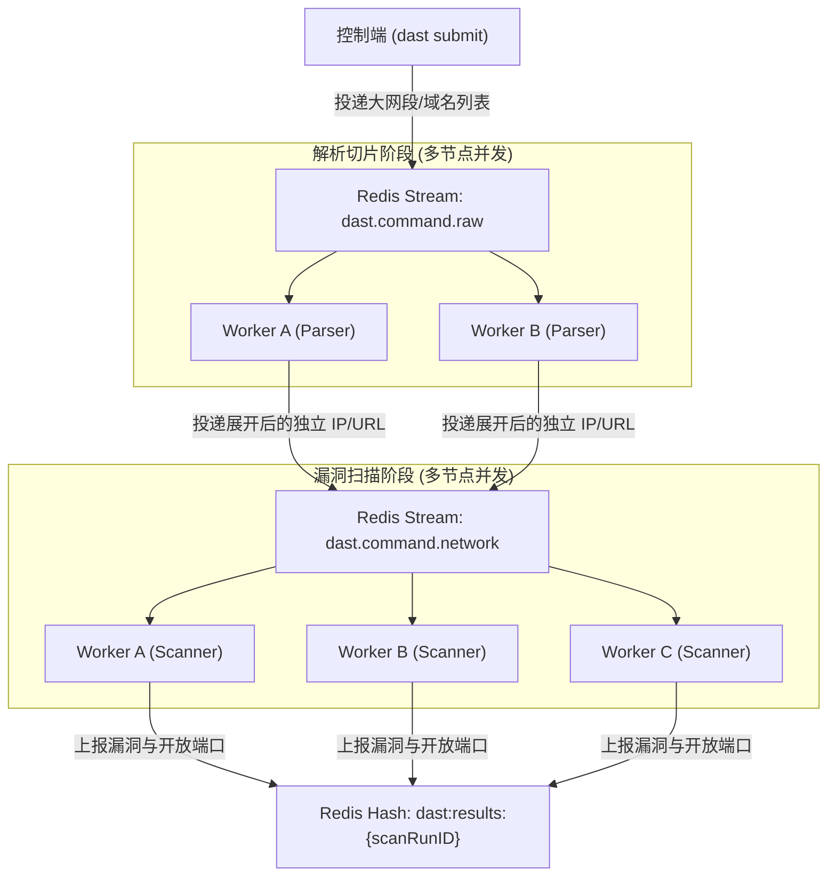

# DAST

DAST 是一个基于 Go 开发的黑盒漏洞扫描器，支持单机 CLI 运行与基于 Redis Streams 的多节点分布式集群部署。扫描链路为目标解析、端口发现、服务与指纹识别、Nuclei POC 漏洞验证及去重聚合。

---

## 快速开始

### 1. 环境准备

- **Go**：`Go >= 1.24.0`
- **Nmap**（可选，用于 `-sV` 深度服务探测）：
  - Debian/Ubuntu: `sudo apt install -y nmap`
  - macOS: `brew install nmap`
  - Windows: 安装官方二进制并加入 `PATH`

### 2. 编译构建

Windows 环境下 ：
```powershell
go build -o AppName.exe ./cmd/dast
```

### 3. 同步 POC 模板

扫描引擎依赖 Nuclei YAML 格式模板，可通过内置命令拉取或手动克隆：

```bash
# 方式 A：
./dast update --poc

# 方式 B：
git clone --depth 1 https://github.com/projectdiscovery/nuclei-templates.git ./poc
```

### 4. 首次扫描

```bash
# 扫描指定 Web 目标
./dast scan -target "http://example.com" -profile "fast"
```

---

## 功能

扫描器采用流水线架构，从输入解析到最终报告：

1. **目标解析与 Scope 评估 (`1_engine.go`)**
   - 支持单个 IP、CIDR 网段（如 `192.168.1.0/24`）、域名与完整 URL。
2. **端口存活与网络发现 (`2_portscan.go`)**
   - 内置基于 go 的高并发 tcp 探测，以及 nmap 服务。
   - 提供 `fast`（Top 100 常见端口）、`balanced`（Top 1000 端口）和 `deep`（全端口/扩展端口）三种预设，支持通过 `-ports` 自定义端口列表或范围。
3. **服务识别与技术栈分析 (`3_service.go`)**
   - 结合 Nmap 服务指纹匹配与 Web 指纹库（`data/fingerprints.json`）。
   - 识别应用层组件、中间件版本与 Web 框架，为后续 POC 匹配提供上下文。
4. **POC 漏洞验证 (`4_poc.go`)**
   - 集成 Nuclei 引擎执行 YAML 规则验证。
   - 支持依据前期资产指纹匹配 POC，降低发包量、扫描强度。
5. **全局去重与报告输出 (`5_dedup.go` / `report.go`)**
   - 资产层与漏洞层确定性去重，避免重复资产与重复告警。
   - 扫描完成后统一输出结构化 JSON 报告与 Markdown 汇总报告。

---

## 目录结构

```text
.
├── cmd/
│   └── dast/                   #主程序入口
│       └── main.go
├── internal/
│   ├── engine/                 # 扫描流水线
│   │   ├── 1_engine.go         # [阶段 1] 目标解析
│   │   ├── 2_portscan.go       # [阶段 2] 端口存活发现
│   │   ├── 3_service.go        # [阶段 3] 服务与指纹识别
│   │   ├── 4_poc.go            # [阶段 4] Nuclei POC 漏洞验证
│   │   └── 5_dedup.go          # [阶段 5] 资产与漏洞去重
│   ├── distributed/            
│   │   ├── envelope.go         # 消息信封协议
│   │   ├── streams.go          # Redis Streams 封装
│   │   └── worker.go           # Worker 运行时
│   ├── api/                    # 控制面 HTTP 服务
│   │   └── server.go
│   ├── config/                 # 运行时配置读取
│   │   └── config.go
│   ├── model/                  
│   ├── service/                # 报告导出、POC/字典更新
│   │   ├── report.go
│   │   └── updater.go
│   └── storage/                # 本地持久化存储
├── data/
│   └── fingerprints.json       # 指纹数据
├── poc/                        # Nuclei POC 模板目录
├── result/                     # 扫描报告输出目录
├── .env                        # 配置文件
├── go.mod
└── README.md
```

---

## 如何部署

### 模式一：单 CLI 独立运行

适用于日常安全巡检、单目标测试或作为脚本工具。

#### 1. 目标预解析 (可选)

可使用 `normalize` 命令验证输入解析

```bash
./dast normalize -target "192.168.1.0/28"
./dast normalize -target "https://example.com:8443"
```

#### 2. 执行扫描

`scan` 子命令支持常用选项：

| 参数 | 说明 | 默认值 |
| :--- | :--- | :--- |
| `-target` | 扫描目标，多个以逗号分隔（支持 IP/CIDR/域名/URL） | 必填 |
| `-profile` | 扫描深度预设：`fast`、`balanced`、`deep` | `fast` |
| `-ports` | 自定义端口（如 `80,443,8000-8080`），优先级高于 profile | 空（使用 profile 预设） |
| `-poc-dir` | Nuclei POC 模板路径 | `./poc` |
| `-output` | JSON 报告输出路径 | `result/scan_report.json` |
| `-md` | Markdown 摘要报告输出路径 | `result/report.md` |

**示例**：

```bash
# 1. 快速扫描单个 IP
./dast scan -target "127.0.0.1" -profile "fast"

# 2. 扫描混合目标
./dast scan -target "192.168.1.1,192.168.1.2,http://testphp.vulnweb.com" \
  -profile "balanced" \
  -md "result/report.md"

# 3. 扫描子网段并指定端口范围
./dast scan -target "192.168.1.0/24" -ports "80,443,8000-8009,3306,6379" -profile "deep"

# 4. 指定自定义 POC 规则目录
./dast scan -target "example.com" -poc-dir "/opt/custom-poc"
```

---

### 模式二：多节点分布式集群部署

适用于大规模巡检场景。



- **第一阶段**：接收原始输入（如大网段 `10.0.0.0/16`、域名列表），进行 DNS 解析与网段切片。
- **第二阶段：将切片后的独立目标（IP/URL）下发至扫描队列，多 Worker 执行扫描，结果集中汇聚至 Redis 节点。

#### 1. 启动 Redis

```bash
docker run -d --name dast-redis -p 6379:6379 redis:7-alpine
```

#### 2. 配置节点环境

在各节点部署 `dast` 二进制及 `data/` 目录，并确保同目录存在 `.env`（或通过环境变量注入）：

```ini
REDIS_ADDR= redis 地址
REDIS_PASSWORD= redis 密码
REDIS_DB=0
POC_DIR=./poc
FP_RULES_FILE=./data/fingerprints.json
```

#### 3. 启动 Worker 节点

每个 Worker 进程均内置了任务解析循环与扫描循环：

```bash
# 默认监听 dast.command.raw 与 dast.command.network
./dast worker

# 可选自定义 stream 与消费者组名称
./dast worker -raw-stream "dast.command.raw" -target-stream "dast.command.network" -group "worker.group.1"
```

可在多台服务器上启动任意数量的 Worker 实例，消费组会自动平衡任务负载。

#### 4. 投递任务

在任意可连通 Redis 的机器上执行 `submit` 投递任务：

```bash
./dast submit -target "10.0.0.0/16,testphp.vulnweb.com,192.168.1.0/24" -profile "fast"
```

提交后将输出任务批次 ID（`scanRunID`），后台 Worker 自动执行分片与扫描。

#### 5. 队列监控与管理

通过 `redis-cli` 监控任务状态与结果：

```bash
# 查看原始解析队列积压量
redis-cli XLEN dast.command.raw

# 查看待扫描目标队列积压量
redis-cli XLEN dast.command.network

# 查看消费组与消费者状态
redis-cli XINFO GROUPS dast.command.network

# 查询某批次扫描结果
redis-cli HGETALL dast:results:<scanRunID>

# 中断扫描任务
redis-cli PUBLISH dast:control "STOP <scanRunID>"
```
