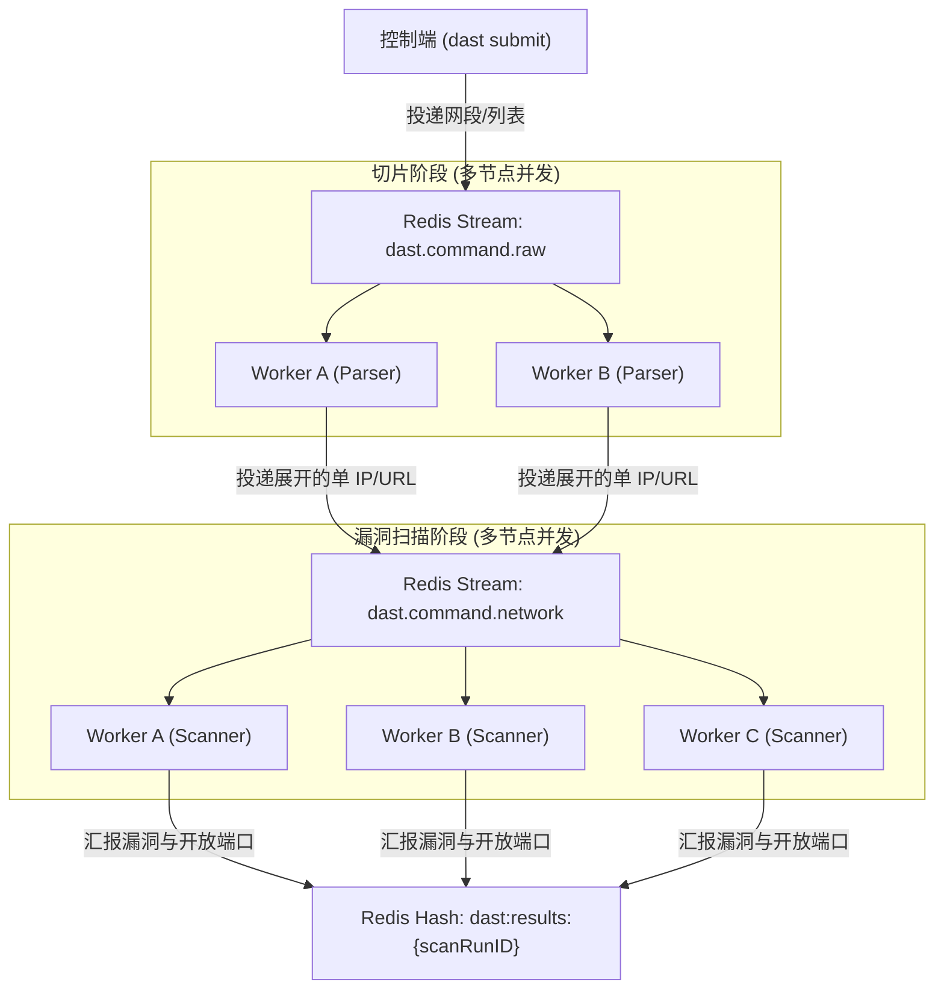

# DAST

DAST 是一个 Go 编写的黑盒漏洞扫描支持单机 CLI 和 Redis Streams 多节点分布式的集群扫描器。流水线涵盖目标解析、端口发现、指纹识别、Neutron poc 漏洞验证及去重聚合。

---

##  快速开始

### 1. 基础环境

- **Go**: `Go >= 1.24.0`
- **Nmap**：
  - Debian/Ubuntu: `sudo apt install -y nmap`
  - macOS: `brew install nmap`
  - Windows: 安装官方包并配置 `PATH`

### 2. 编译构建

Windows 示例:
```powershell
go build -o dast.exe ./cmd/dast
```

### 3. 同步 POC 模板

扫描依赖 Neutron YAML 格式模板，请通过以下方式获取最新数据：

```bash
./dast update --poc

git clone --depth 1 https://github.com/chainreactors/templates.git ./poc
```

### 4. 首次扫描

```bash
# 扫描指定 Web 目标
./dast scan -target "http://example.com" -profile "fast"
```

---

## 架构说明

扫描流水线架构如下：

1. **目标 Scope 解析 (`internal/model/target.go` 与 `pkg/pipeline`)**
   - 支持单 IP、CIDR 网段（如 `192.168.1.0/24`）、多 URL 并发输入，由 Pipeline 统一转化为标准化资产实体。
2. **端口与存活发现 (`internal/domain/portscan/portscan.go`)**
   - 提供 `fast`（Top 100 端口）、`balanced`（Top 1000 端口）、 `deep`（全端口/扩展端口）预设，支持通过 `-ports` 自定义端口列表和范围。
3. **资产指纹识别 (`internal/domain/fingerprint/service.go`)**
   - 基于 Nmap 基础扫描与 `chainreactors/fingers` 引擎。
   - 支持 HTTP/TCP 多维特征指纹，识别应用层中间件版本与 Web 框架，为下级 POC 匹配提供精确数据。
4. **POC 漏洞验证 (`internal/domain/poc/neutron_poc.go`)**
   - 通过 Neutron 引擎执行轻量级 YAML 漏洞验证。
   - 包含 POC 索引与路由逻辑 (`rule_index.go`)，支持前置资产指纹匹配的 POC 分发，扫描高效。
5. **全局去重与报告 (`internal/domain/dedup/dedup.go` & `pkg/pipeline/report.go`)**
   - 漏洞去重，过滤重复资产告警。
   - 扫描结束后统一生成结构化 JSON 和 Markdown 总结报告。

---

## 目录结构

```text
.
├── cmd/
│   └── main.go                 
├── internal/
│   ├── app/                    
│   │   ├── api/                
│   │   └── updater/            # 更新
│   ├── config/                 # 配置读取
│   ├── domain/                 
│   │   ├── dedup/              # 资产与漏洞去重
│   │   ├── fingerprint/        # 资产指纹识别引擎
│   │   ├── poc/                # poc 漏洞验证
│   │   └── portscan/           # 端口存活与基础服务发现
│   ├── infra/                  
│   │   ├── llm/                # todo...
│   │   ├── mq/                 # Redis Streams 分封装协议
│   │   ├── network/            # 网络发包封装
│   │   └── storage/            # 存储
│   └── model/                  
├── pkg/
│   ├── logger/                 
│   └── pipeline/               # 扫描编排
├── poc/                        # POC 模板目录
├── result/                     # 扫描报告默认输出目录
├── .env                        # 配置文件
├── go.mod
└── README.md
```

---

## 使用参考

### 模式一：单机 CLI 扫描

日常全局巡检、单点目标测试为主

#### 1. 执行扫描

`scan` 命令支持众多选项：

| 参数 | 说明 | 默认值 |
| :--- | :--- | :--- |
| `-target` | 扫描目标，支持逗号分隔，支持 IP/CIDR/网段/URL。   | 无 |
| `-ports`  | 自定义端口，如 `80,443,8000-8080`               | 空                        |
| `-output` | JSON 报告路径                                   | `result/scan_report.json` |
| `-md`     | Markdown 摘要报告路径                           | `result/report.md`        |

**示例**：

```bash
# 1. 快速扫描单个 IP
./dast scan -target "127.0.0.1" -profile "fast"

# 2. 扫描多目标集合
./dast scan -target "192.168.1.1,192.168.1.2,http://testphp.vulnweb.com" \
  -profile "balanced" \
  -md "result/report.md"

# 3. 扫描并指定端口范围
./dast scan -target "192.168.1.0/24" -ports "80,443,8000-8009,3306,6379" -profile "deep"

# 4. 指定自定义 POC 库目录
./dast scan -target "example.com" -poc-dir "/opt/custom-poc"
```

---

### 模式二：多节点分布式集群

在大型巡检场景下开启该模式。



- **第一阶段**：原始输入（如 `10.0.0.0/16`、大列表）的 DNS 与切片。
- **第二阶段**：切片后的目标（IP/URL）下发扫描队列，Worker 执行深度扫描，结果回传 Redis 节点。

#### 1. 启动 Redis

```bash
docker run -d --name dast-redis -p 6379:6379 redis:7-alpine
```

#### 2. 配置节点环境变量

在各节点部署 `dast` 及推荐的 `data/` 目录，确保同目录下有 `.env`（或通过环境变量注入）：

```ini
REDIS_ADDR= redis 地址
REDIS_PASSWORD= redis 密码
REDIS_DB=0
POC_DIR=./poc
```

#### 3. 启动 Worker 节点

每个 Worker 进程即为循环扫描队列守护进程：

```bash
# 默认监听 dast.command.raw 和 dast.command.network
./dast worker

# 可选自定义 stream 队列与组
./dast worker -raw-stream "dast.command.raw" -target-stream "dast.command.network" -group "worker.group.1"
```

可启动多台机器的 Worker 实现自动负载均衡。

#### 4. 投递任务

由控制端服务器/主机执行 `submit` 投递任务：

```bash
./dast submit -target "10.0.0.0/16,testphp.vulnweb.com,192.168.1.0/24" -profile "fast"
```

提交后返回任务 ID（`scanRunID`），后台 Worker 自动执行分片和漏洞扫描。

#### 5. 巡检监控

通过 `redis-cli` 可掌握队列状态：

```bash
# 查看原始任务队列积压
redis-cli XLEN dast.command.raw

# 查看深扫描目标队列积压
redis-cli XLEN dast.command.network

# 查看消费者状态
redis-cli XINFO GROUPS dast.command.network

# 查询某次扫描结果
redis-cli HGETALL dast:results:<scanRunID>

# 中断扫描任务
redis-cli PUBLISH dast:control "STOP <scanRunID>"
```
